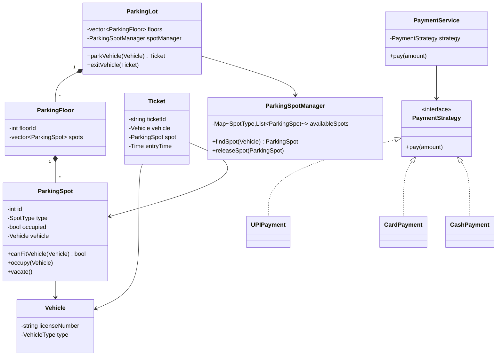

# Parking Lot — LLD Quick Revision

## 1. Mental Picture

```text
ParkingLot
   ↓ HAS MANY
ParkingFloor
   ↓ HAS MANY
ParkingSpot

Vehicle → SpotManager → ParkingSpot
                ↓
              Ticket
                ↓
        Fee + Payment
```

**Core idea:**
- `ParkingSpot` = state
- `ParkingSpotManager` = allocation/index
- `Ticket` = parking session
- `PaymentStrategy` = variable payment behavior

---

## 2. Classes — kaun class / interface / enum?

### `ParkingLot` — class
Overall parking lot ko coordinate karta hai.

```text
class ParkingLot {
    vector<ParkingFloor*> floors;
    ParkingSpotManager spotManager;
}
```

### `ParkingFloor` — class
Ek floor ke spots rakhta hai.

```text
class ParkingFloor {
    int floorId;
    vector<ParkingSpot*> spots;
}
```

### `ParkingSpot` — class
Spot ka type + occupied/free state maintain karta hai.

```text
class ParkingSpot {
    int id;
    SpotType type;
    bool occupied;
    Vehicle* vehicle;

    bool canFitVehicle(Vehicle* v);
    void occupy(Vehicle* v);
    void vacate();
}
```

### `Vehicle` — class
Abhi separate `Bike/Car/Truck` subclasses ki need nahi; sirf type different hai.

```text
class Vehicle {
    string licenseNumber;
    VehicleType type;
}
```

### `VehicleType` — enum

```text
enum class VehicleType {
    BIKE, CAR, TRUCK
};
```

### `SpotType` — enum

```text
enum class SpotType {
    SMALL, MEDIUM, LARGE
};
```

### `Ticket` — class
Ek parking session ko represent karta hai.

```text
class Ticket {
    string ticketId;
    Vehicle* vehicle;
    ParkingSpot* spot;
    time_t entryTime;
};
```

### `ParkingSpotManager` — class
Available spots ko efficiently maintain, assign aur release karta hai.

```text
class ParkingSpotManager {
    map<SpotType, queue<ParkingSpot*>> availableSpots;

    ParkingSpot* findSpot(Vehicle* vehicle);
    void releaseSpot(ParkingSpot* spot);
};
```

### `PaymentStrategy` — interface
Payment ka behavior variable hai, isliye Strategy.

```text
class PaymentStrategy {
public:
    virtual void pay(double amount) = 0;
    virtual ~PaymentStrategy() = default;
};
```

Implementations:

```text
UPIPayment
CardPayment
CashPayment
```

### `PaymentService` — class
Strategy ko use/coordinate karta hai.

```text
class PaymentService {
    unique_ptr<PaymentStrategy> strategy;
};
```

### `FeeCalculator`
Agar fee calculation simple hai → normal class.

Agar multiple algorithms hain (Hourly/Flat/Dynamic) → interface/Strategy:

```text
FeeCalculationStrategy
        ↑
HourlyFeeCalculator
FlatFeeCalculator
DynamicFeeCalculator
```

---

## 3. Class Diagram



---

## 4. Entry Flow

```text
Vehicle
  ↓
ParkingLot.parkVehicle(vehicle)
  ↓
ParkingSpotManager.findSpot(vehicle)
  ↓
availableSpots se suitable spot
  ↓
spot.occupy(vehicle)
  ↓
Ticket create
  ↓
Ticket return
```

**No suitable spot:** `NO_SPOT_AVAILABLE`.

Car ke liye example rule: `MEDIUM` prefer, `LARGE` fallback (agar requirement allow kare).

---

## 5. Exit Flow

```text
Ticket
  ↓
Fee calculate
  ↓
PaymentService
  ↓
PaymentStrategy.pay()
  ↓
ParkingSpot.vacate()
  ↓
ParkingSpotManager.releaseSpot()
  ↓
spot available again
```

---

## 6. Important Responsibility Rule

```text
ParkingSpot
    → apni occupied/free state manage kare

ParkingSpotManager
    → available-spots collection/index manage kare
    → spot assign/release kare

Ticket
    → parking session represent kare

PaymentStrategy
    → payment method ka behavior
```

**Spot ko Manager ke data structure ka knowledge nahi dena.** Observer optional hai; simple design mein Manager khud operation coordinate kar sakta hai.

---

## 7. C++ Interview-Level Code

```cpp
#include <iostream>
#include <string>
#include <vector>
#include <unordered_map>
#include <queue>
#include <memory>
#include <ctime>

using namespace std;

enum class VehicleType { BIKE, CAR, TRUCK };
enum class SpotType { SMALL, MEDIUM, LARGE };

class Vehicle {
    string licenseNumber;
    VehicleType type;

public:
    Vehicle(string licenseNumber, VehicleType type)
        : licenseNumber(move(licenseNumber)), type(type) {}

    VehicleType getType() const { return type; }
    string getLicenseNumber() const { return licenseNumber; }
};

class ParkingSpot {
    int id;
    SpotType type;
    bool occupied = false;
    Vehicle* vehicle = nullptr;

public:
    ParkingSpot(int id, SpotType type) : id(id), type(type) {}

    int getId() const { return id; }
    SpotType getType() const { return type; }
    bool isOccupied() const { return occupied; }

    bool canFitVehicle(Vehicle* v) const {
        if (occupied) return false;

        switch (v->getType()) {
            case VehicleType::BIKE:
                return type == SpotType::SMALL;
            case VehicleType::CAR:
                return type == SpotType::MEDIUM || type == SpotType::LARGE;
            case VehicleType::TRUCK:
                return type == SpotType::LARGE;
        }
        return false;
    }

    void occupy(Vehicle* v) {
        occupied = true;
        vehicle = v;
    }

    void vacate() {
        occupied = false;
        vehicle = nullptr;
    }
};

class Ticket {
    string ticketId;
    Vehicle* vehicle;
    ParkingSpot* spot;
    time_t entryTime;

public:
    Ticket(string ticketId, Vehicle* vehicle, ParkingSpot* spot)
        : ticketId(move(ticketId)), vehicle(vehicle), spot(spot),
          entryTime(time(nullptr)) {}

    ParkingSpot* getSpot() const { return spot; }
    Vehicle* getVehicle() const { return vehicle; }
};

class ParkingSpotManager {
    unordered_map<SpotType, queue<ParkingSpot*>> availableSpots;

public:
    void addSpot(ParkingSpot* spot) {
        availableSpots[spot->getType()].push(spot);
    }

    ParkingSpot* getAvailableSpot(SpotType type) {
        auto& q = availableSpots[type];
        if (q.empty()) return nullptr;
        ParkingSpot* spot = q.front();
        q.pop();
        return spot;
    }

    ParkingSpot* findSpot(Vehicle* vehicle) {
        if (vehicle->getType() == VehicleType::BIKE)
            return getAvailableSpot(SpotType::SMALL);

        if (vehicle->getType() == VehicleType::CAR) {
            auto* spot = getAvailableSpot(SpotType::MEDIUM);
            if (spot) return spot;
            return getAvailableSpot(SpotType::LARGE);
        }

        return getAvailableSpot(SpotType::LARGE);
    }

    void releaseSpot(ParkingSpot* spot) {
        spot->vacate();
        availableSpots[spot->getType()].push(spot);
    }
};

// Strategy Pattern
class PaymentStrategy {
public:
    virtual void pay(double amount) = 0;
    virtual ~PaymentStrategy() = default;
};

class UPIPayment : public PaymentStrategy {
public:
    void pay(double amount) override {
        cout << "Paid via UPI: " << amount << '\n';
    }
};

class CardPayment : public PaymentStrategy {
public:
    void pay(double amount) override {
        cout << "Paid via Card: " << amount << '\n';
    }
};

class CashPayment : public PaymentStrategy {
public:
    void pay(double amount) override {
        cout << "Paid via Cash: " << amount << '\n';
    }
};

class PaymentService {
    unique_ptr<PaymentStrategy> strategy;

public:
    PaymentService(unique_ptr<PaymentStrategy> strategy)
        : strategy(move(strategy)) {}

    void pay(double amount) {
        strategy->pay(amount);
    }
};

class ParkingFloor {
    int floorId;
    vector<ParkingSpot*> spots;

public:
    ParkingFloor(int floorId) : floorId(floorId) {}

    void addSpot(ParkingSpot* spot) {
        spots.push_back(spot);
    }
};

class ParkingLot {
    vector<ParkingFloor*> floors;
    ParkingSpotManager spotManager;

public:
    void addFloor(ParkingFloor* floor) {
        floors.push_back(floor);
    }

    void registerSpot(ParkingSpot* spot) {
        spotManager.addSpot(spot);
    }

    Ticket* parkVehicle(Vehicle* vehicle) {
        ParkingSpot* spot = spotManager.findSpot(vehicle);

        if (!spot) {
            cout << "No suitable parking spot available\n";
            return nullptr;
        }

        spot->occupy(vehicle);
        return new Ticket("T1", vehicle, spot);
    }

    void exitVehicle(Ticket* ticket) {
        // Simplified fee for interview demo.
        double fee = 100;

        PaymentService payment(make_unique<UPIPayment>());
        payment.pay(fee);

        spotManager.releaseSpot(ticket->getSpot());
    }
};
```

---

## 8. Patterns — kab use karna hai?

### Strategy ✅
Payment method change ho: UPI/Card/Cash.

Fee calculation algorithms multiple hon: Hourly/Flat/Dynamic.

> **Mental trigger:** behavior/algorithm change → Strategy.

### Observer ⚠️ Optional
Spot state change par display/notification jaise multiple components ko notify karna ho tab useful.

Core allocation ke liye required nahi.

> **Mental trigger:** state change → many interested objects ko notify.

### Template Method ❌ Basic Parking Lot mein nahi
Base class algorithm ka fixed skeleton banaye aur child kuch steps override kare tab Template Method.

Simple `Vehicle` hierarchy Template Method nahi hai.

---

## 9. Concurrency Follow-up

Do requests same free spot ko simultaneously assign na kar paayen.

**`find + remove + assign` atomic/thread-safe hona chahiye.**

Conceptually:

```text
lock
  find available spot
  remove from available list
  mark occupied
unlock
```

---

## 10. LLD vs HLD

Normal **Parking Lot interview = LLD/OOP**.

CAP theorem yahan normally discuss nahi karna.

Agar interviewer bole: **“India mein 10,000 parking lots ka distributed system design karo”**, tab HLD topics aa sakte hain: APIs, DB, scaling, caching, consistency, concurrency, etc.

---

## 11. Interview Answer in 30 Seconds

> “I would model ParkingLot as a collection of ParkingFloors, and each floor contains ParkingSpots. Vehicle contains its type, while ParkingSpotManager maintains available spots and handles allocation/release. On entry, the manager finds a suitable spot, the spot becomes occupied, and a Ticket is created. On exit, we calculate the fee, process payment, vacate the spot, and return it to the available pool. For variable payment methods I would use Strategy Pattern. I would avoid forcing Observer or Template Method unless the requirements actually need them.”
